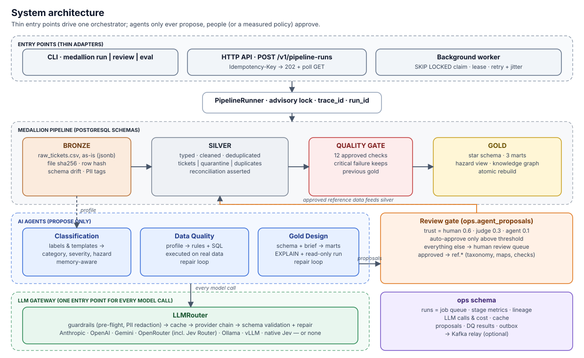

# AI-assisted medallion pipeline: facility support tickets

Bronze → silver → gold over 10,280 messy maintenance tickets. AI agents classify the free text,
propose data-quality rules and design gold models; every agent suggestion is verified by code and
gated by human review before it changes anything.

> **Powered by Jev (TypeSafe).** The recommended configuration runs ticket classification *and* the
> LLM-as-judge on **Jev Router**, TypeSafe's System-One model, which picks the right model per request.
> Measured on this task: the same quality as a fixed frontier model (100% on phrasing it had never
> seen) at **3–4× lower cost** ($0.06–0.08 vs $0.24 for the full evaluation; the router's choices vary by run).
> As the judge, combined with human feedback, it lifted auto-approval precision from 79% to 97%. **Native Jev**
> (typed choices with calibrated probabilities) runs on the same OpenRouter key: 98–99% category accuracy
> for $0.008, 7–10× cheaper again. → [Why Jev](docs/AI_PLATFORM.md#jev-by-typesafe)



## Run it: one command

**Prerequisite:** Docker (with Compose v2). Nothing else.

### Without any API keys (default)

```bash
docker compose up --build
```

That single command starts Postgres, applies migrations, runs the whole pipeline (bronze → silver →
quality gate → gold), prints a report of every layer, and leaves the API (http://localhost:8000/docs)
and the background worker running.

No keys are needed because the agents' output was already generated, **reviewed by a human** and
committed as reference data (`config/seeds/`). Without a model configured, the agents fall back to
deterministic rules.

### With API keys (enables the live agents)

Create `.env` from the template, fill in **one** of the options below, then run the same command.

```bash
cp .env.example .env    # edit it, then:
docker compose up --build
```

| You want | Put this in `.env` |
|---|---|
| **Recommended: Jev Router for all three agents and the judge** | `LLM_PROVIDERS=openrouter` · `OPENROUTER_API_KEY=…` · `OPENROUTER_MODEL=typesafe/jev-router` · `JUDGE=openrouter:typesafe/jev-router` |
| Any other hosted model through the same key | as above with e.g. `OPENROUTER_MODEL=anthropic/claude-sonnet-5.5` |
| Anthropic directly | `LLM_PROVIDERS=anthropic` · `ANTHROPIC_API_KEY=…` (model defaults to `claude-opus-5-5`) |
| OpenAI directly | `LLM_PROVIDERS=openai` · `OPENAI_API_KEY=…` · `OPENAI_MODEL=…` |
| Google Gemini | `LLM_PROVIDERS=gemini` · `GEMINI_API_KEY=…` · `GEMINI_MODEL=…` |
| Local model, no key | run `OLLAMA_CONTEXT_LENGTH=16384 ollama serve` (+ `ollama pull gemma3:4b`), then `LLM_PROVIDERS=ollama` · `OLLAMA_CONTEXT_TOKENS=16384` |
| A fallback chain | comma-separate them in order, e.g. `LLM_PROVIDERS=openrouter,ollama` |
| Native Jev typed classification (cheapest; same OpenRouter key) | add `CLASSIFIER_BACKEND=jev` to the recommended setup |

All other settings (retries, rate limits, budgets, alert thresholds) have defaults; see
[`.env.example`](.env.example). Credentials are read only from `.env` or the environment.

### Useful follow-ups

```bash
docker compose run --rm cli medallion report             # tour of every layer
docker compose run --rm cli medallion review list        # human-in-the-loop queue
docker compose run --rm cli medallion agent-dq           # Data Quality Agent (needs a model)
docker compose run --rm cli medallion agent-gold         # Gold Design Agent (needs a model)
docker compose run --rm cli medallion eval --strategies rules,openrouter:typesafe/jev-router   # rules FAIL the 90% gate on purpose: 31.7% on new phrasing
docker compose run --rm cli medallion synth --rows 20000 --run   # random messy data, scored vs ground truth
docker compose run --rm cli sh -c 'API_URL=http://api:8000 medallion submit --wait'
```

Tests: `uv run pytest` (start the stack first for the integration tests).

## Layers and gold models (why these)

**Storage:** PostgreSQL 16 with one schema per layer (`bronze`, `silver`, `gold`, plus `ref` for
approved reference data and `ops` for pipeline metadata). Schemas give a hard boundary that
permissions can enforce, and one database keeps it runnable with one command.
Details: [docs/DATA_PIPELINE.md](docs/DATA_PIPELINE.md).

Gold is a star schema at ticket grain (`fct_tickets` + category, building, assignee and date
dimensions) feeding the three marts a facilities lead asks for first:

| Mart | Question it answers | Why this one |
|---|---|---|
| `mart_sla_performance` | Are we meeting SLAs, and where are we slipping? | SLAs are the contract with the business; every rate carries the row count it is based on, because many tickets lack a usable SLA or resolution time |
| `mart_vendor_scorecard` | Which vendors and teams are fast, cheap, or doing rework? | Drives contract and staffing decisions; includes rework signals parsed from resolution notes |
| `mart_open_backlog` | Where is work piling up right now, and how old is it? | The operational view: aging buckets and tickets past SLA, deterministic as-of date |

Plus `v_underprioritised_hazards`: open safety hazards that a human filed as low priority, which only
exists because the classification agent derives hazard and severity from free text.

## Agent assessment (summary)

Full write-ups, samples and numbers: [docs/AGENTS.md](docs/AGENTS.md) and [docs/EVALUATION.md](docs/EVALUATION.md).

| Agent (brief option) | What it does | Sample | Honest take |
|---|---|---|---|
| **Semantic classification** (c) | Maps 92 messy category spellings and 92 description templates to a taxonomy, severity, safety hazard and issue type; output lands in silver as queryable columns | `"Sparking outlet in <bldg> — DO NOT USE"` → `electrical / critical / hazard` | **Saved real time** on description enrichment (≈1 h of manual labelling → minutes) and is the only thing that generalises: rules score 31.7% on new phrasing, LLMs 90–100%. On the 92 label spellings alone it saved ~10 minutes, with every item still reviewed. |
| **Data quality** (b) | Profiles bronze, proposes rules with business rationale, cleaning SQL and checks, all *executed* before review | `cost_parse_and_sentinels`: "-1/-999 sentinels corrupt vendor spend totals" + predicate + measured violation rate | **Good first draft, dangerous unverified:** ~1 h of writing in about a minute, but 4 of 12 rules were valid-but-wrong SQL. The executed evidence made all 4 obvious. |
| **Gold design** (d) | Proposes marts from the schema + a business brief; SQL is EXPLAINed and run read-only; approval creates sandbox views | "Where are open safety hazards aging?" → `mart_open_safety_hazard_exposure` | **Saved time:** 3 sensible marts in about a minute. I trust it for exploration; a human owns metric definitions before anything reaches `gold`. |
| Schema inference (a) | *Not built.* Schema drift detection (its bonus) is done deterministically in bronze | — | With one well-understood source, hand-writing the 45-column silver schema took less time than reviewing an agent's DDL would. I'd build it when many new sources arrive. |

## What changes at 100x (summary)

Full plan: [docs/SCALING.md](docs/SCALING.md).
- **Bronze** to object storage (Parquet/Iceberg, partitioned by ingest date). The content-addressed
  manifest already makes daily files idempotent.
- **Silver becomes incremental:** `MERGE` on `ticket_id` for new landings only, with a replay window for
  late or corrected records (re-derive affected partitions, never the whole table), and dedup
  fingerprints persisted and indexed.
- **LLM cost scales with *new distinct values*, not rows.** Templates, caching and the review queue mean
  a daily run makes tens of calls; backfills use batch APIs or a self-hosted vLLM; Jev Router cuts
  per-call cost 3–4×.
- **Operations:** an orchestrator (Dagster/Airflow) instead of the home-grown worker, shared rate
  limits (Redis), metrics to Prometheus with the existing alert thresholds.

## Core vs optional (to keep it from being overkill)

The **core** is what the brief asks for and what runs by default: bronze → silver → quality gate →
gold, the three agents behind a human review gate, the eval harness, and the LLM gateway (only when a
model is configured). Everything else is **off unless you enable it**, and its measured value is in
[EVALUATION.md](docs/EVALUATION.md).

**Reading path for reviewers (~1,900 lines, core only):** `pipeline/bronze.py` →
`pipeline/silver/parsers.py` + `transform.py` → `sql/gold/` → `agents/classification.py`,
`data_quality.py`, `gold_design.py` and their prompts in `agents/prompts/`. Nothing in the table below
is needed to understand or run the brief's pipeline.

| Optional piece | Enable with | Measured value |
|---|---|---|
| LLM-as-judge + human-weighted trust | `JUDGE=…` | Auto-approval errors 21 → 5; review queue ranks 100% true mistakes in the top 10 |
| Agent memory | on when a model is configured | Helps recurring data (+3.3 points on templates), **no gain on new phrasing** |
| Repair loop | always on for SQL agents | Rescues mid-tier models (incl. Jev Router); nothing to repair for frontier models |
| Ontology / knowledge graph | `config/ontology.yaml` | Removed 450 false conflict flags |
| Kafka relay | `--profile kafka` | Outbox events to a topic; the pipeline never depends on it |
| API + background worker | started by compose | Idempotent run submission; the CLI alone is enough for the brief |
| Native Jev classifier | `CLASSIFIER_BACKEND=jev` | 98–99% categories for $0.008 per full eval; over-flags hazards (91%) |

## Documentation

| Document | What's in it |
|---|---|
| [Architecture](docs/ARCHITECTURE.md) | Components, diagrams, design patterns and SOLID, project layout |
| [Data pipeline](docs/DATA_PIPELINE.md) | Bronze / silver / quality gate / gold, idempotency, lineage, why these gold models |
| [Cleaning rules](docs/CLEANING_RULES.md) | Every silver rule with its row counts and rationale |
| [AI agents](docs/AGENTS.md) | The three agents, real input/output samples, and an honest "did it save time?" for each |
| [AI platform](docs/AI_PLATFORM.md) | LLM gateway, **Jev by TypeSafe**, providers, guardrails, memory, LLM-as-judge, loops, ontology; what was deliberately left out (MCP, deep agents, Bedrock) |
| [Evaluation & A/B results](docs/EVALUATION.md) | Eval harness and every A/B with measured numbers: rules vs local vs frontier vs Jev Router, prompts, memory, judge, loop, ontology |
| [Operations](docs/OPERATIONS.md) | API, idempotency, worker, retries, Kafka, observability, CLI and configuration reference |
| [Scaling & tradeoffs](docs/SCALING.md) | What changes at 100x, and what I would do differently |
| [Testing](docs/TESTING.md) | What the tests cover, and the random synthetic-data runs scored against ground truth |
| [Brief checklist](docs/CHECKLIST.md) | Every requirement in the brief, and exactly where it is met |
| [Assignment](docs/ASSIGNMENT.md) | The original brief |
