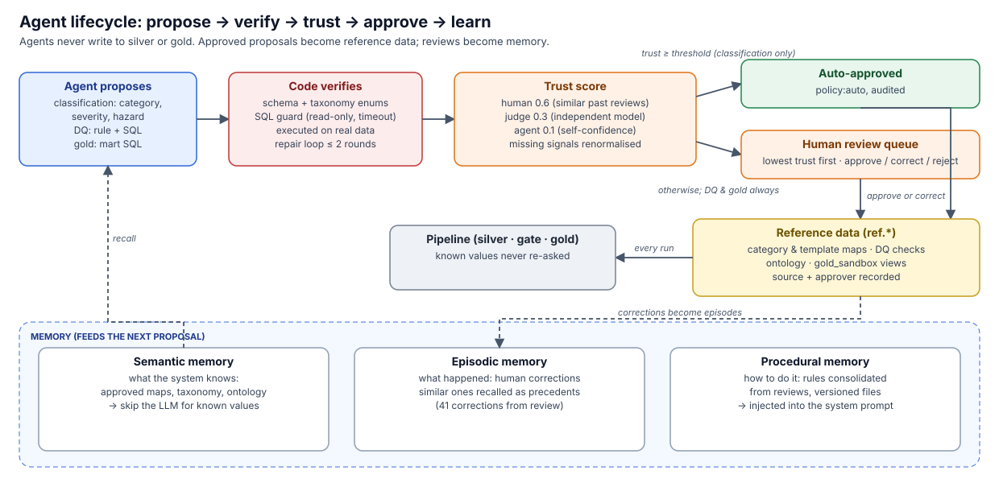

# AI agents

[← back to README](../README.md)



All three agents follow the same contract: the **agent proposes, the code verifies, a human (or an
explicit policy) approves**, and only then does anything change. Agents never write to silver or
gold directly.

## 1. Semantic Classification Agent (option c): the one that earns its keep

**What it does.** It turns two messy free-text columns into structured, queryable silver columns:
- raw `category` labels (92 normalised spellings) → canonical `category`, plus a `label_kind` that
  detects junk, generic labels ("Other") and descriptions typed into the category field;
- description *templates* → `category_from_description`, `issue_type`, `inferred_severity` and
  `is_safety_hazard`.

The description signal also audits the human label. 450 tickets disagreed with their label, and
all were legitimate category overlaps that the [ontology](AI_PLATFORM.md#ontology-and-knowledge-graph)
now recognises; genuine contradictions are still flagged. It also drives the
`v_underprioritised_hazards` view.

It uses all three [memories](AI_PLATFORM.md#memory) and, when `JUDGE` is set, the
[human-weighted trust policy](AI_PLATFORM.md#llm-as-judge-and-human-weighted-trust) for auto-approval.

**How it scales.** The agent never sees rows; it sees **distinct normalised values that have no
approved mapping yet**. Masking buildings, numbers and asset IDs collapses 4,616 distinct descriptions
into 92 templates. Items are batched (10–25 per call) and fanned out concurrently behind the rate
limiter. Every answer is cached, and anything already pending review is skipped. A steady-state daily
run makes **zero** LLM calls unless new values appear.

**Sample**, from a real run with the local model:

```jsonc
// input: two items from a batch of 10 (descriptions with variable parts masked)
{"id": "T7", "template": "sparking outlet in <bldg> — do not use, taped off",
 "example": "Sparking outlet in Data Center 1 — DO NOT USE, taped off"}
{"id": "T2", "template": "ceiling tile falling in <bldg> hallway, <n> floor. hazard.",
 "example": "Ceiling tile falling in Annex West hallway, 9 floor. Hazard."}
// output (gemma3:4b, local), validated against the schema
{"id": "T7", "category": "electrical", "issue_type": "outlet_sparking", "severity": "critical",
 "is_safety_hazard": true, "confidence": 0.90}          // ≥ 0.85 → auto-approved
{"id": "T2", "category": "general_maintenance", "issue_type": "ceiling_tile_fall", "severity": "medium",
 "is_safety_hazard": true, "confidence": 0.70}          // < 0.85 → human review (approved as-is)
```

**Guardrails.**
- The category is constrained to the business taxonomy (schema enum plus Pydantic).
- Cosmetic fields are normalised rather than rejected, so one model writing `door_won't_lock` can't
  sink a batch.
- Inputs are framed as data, not instructions.
- Only LLM answers with confidence ≥ 0.85 are auto-approved; rule-based guesses and low confidence
  go to `medallion review`.
- If an approved mapping later disagrees with the description, the row is flagged; it is never
  silently overwritten.
- The human-entered `priority` is never touched. Inferred severity lives in its own column.

**Honest take.**
- *Labels:* the agent saved me **little** on this file. Mapping 92 spellings by hand took me ~15
  minutes. The model did it in ~2.5 minutes at ~90% accuracy, and I still had to review all 92.
  The value is ongoing: next month's new spellings get mapped without a code change.
- *Description enrichment* is where it **clearly paid off**. Hand-labelling severity, hazard and
  issue type for 92 templates is an hour of tedious judgement; the model did it in ~4 minutes. On
  phrasing that never appears in the source data it is right **90%** of the time, where my
  hand-written keyword rules manage **26.7%**. The rules look great on this file (96–99%) only
  because I wrote them while staring at it. On next month's tickets they'd quietly fall apart.
- The eval paid for itself too. My first prompt (v3) told the model to answer "unknown" for bare
  labels in the description field. The eval showed the model obeying the bad instruction, and
  fixing it raised template accuracy from 88.0% to 91.3% and holdout accuracy from 86.7% to 90.0%.

**What the review of the first real run found.** The local model ran over all 92 labels and 95
templates, and I reviewed every proposal against my hand labels:

| | Labels (92) | Templates (90 with hand labels) |
|---|---|---|
| Auto-approved at confidence ≥ 0.85 | 64, **category right on 64/64** (19 had a wrong `label_kind`) | 35, **category right on 34/35** |
| Sent to review | 28, of which 9 needed a correction | 55, of which 11 needed a correction |

All 41 corrections are recorded as human overrides. They became the **episodic memory** the agent
uses next time, and they motivated replacing self-confidence with a human-weighted **trust** score
for auto-approval. That cut wrongly auto-approved answers from 21 to 5; see
[EVALUATION.md](EVALUATION.md#llm-as-judge--human-weighted-trust).

## 2. Data Quality Agent (option b)

**What it does.** `medallion agent-dq` hands the LLM a compact, bounded **profile** of bronze. It
never sees raw rows; the profile carries null and placeholder rates, distinct counts, value shapes,
numeric percentiles, day/month evidence and duplicate counts. The model returns rules, each with:
- the issue, quoting profile numbers;
- a **business rationale**;
- a cleaning action and expression;
- a severity and threshold;
- a SQL **violation predicate**.

Then the code verifies every rule before a human sees it:
- the cleaning expression is **executed on the column's real top values**, so the reviewer sees
  before → after;
- the predicate is **executed against silver** in a read-only, time-limited transaction, so the
  reviewer sees the actual violation rate next to the proposed threshold;
- anything failing the SQL guard (DDL, `;`, `pg_*`, ops/bronze schemas) or failing to run is
  auto-rejected, with the reason recorded.

Every rule also gets a **groundedness** score: the share of the numbers it cites that really appear in
the profile for its column. Anything unsupported is listed for the reviewer (Haiku 4.5: 0.99, Sonnet 5.5:
0.84, with all of Sonnet's flags turning out to be correct derived numbers;
[details](EVALUATION.md#groundedness-of-agent-claims)).

Approved predicates become `ref.dq_checks`, enforced by the quality gate on every run. A critical
failure blocks gold publication. DQ checks are never auto-approved, because they can stop the
pipeline.

**Sample** (Claude Sonnet 5.5 via OpenRouter; the evidence block is produced by the code, not the model):

```jsonc
{"check_id": "cost_parse_and_sentinels", "severity": "critical",
 "issue": "Cost has 2637 empty, 996 placeholders (N/A 494, TBD 484, error 12, NULL 6), 993 '$'-prefixed,
           195 negatives (-1 x192, -999 x3), 295 zeros; max 14996.24.",
 "rationale": "Sentinel values like -1/-999 and unparsed '$' strings corrupt vendor spend totals and averages.",
 "cleaning_expression": "CASE WHEN regexp_replace(btrim(v),'[$,]','','g') ~ '^[0-9]+(\\.[0-9]+)?$' THEN … ::numeric ELSE NULL END",
 "violation_predicate": "cost_usd IS NOT NULL AND (cost_usd < 0 OR cost_usd > 100000)", "threshold": 0.005,
 "verification": {"cleaning": {"examples": [["N/A", null], ["-1", null], ["-999", null], ["10529.83", "10529.83"]]},
                  "predicate": {"violations": 0, "total": 10055, "violation_rate": 0.0}}}
```

**What the review found.** 12 rules, all passed the SQL guard on the first try (the repair loop had
nothing to do). But the evidence showed **4 were wrong-but-valid**:

| Rule | Problem the evidence exposed | Human correction |
|---|---|---|
| `priority_normalise` | flagged **100%** of rows: compares to `'Critical'`, silver stores `'critical'` | predicate → `priority IS NULL`, threshold 0.12 |
| `status_resolved_consistency` | flagged **100%**: same capitalisation mistake | rewritten for lowercase statuses |
| `resolved_at_parse_and_order` | *critical* at 1% while the real rate is 18.3%: would block gold on **every** run | severity → warning, threshold 0.20 |
| `category_canonicalise` | checks `category IS NULL`, which can't happen (NOT NULL) | predicate → `category = 'unknown'` |

**Honest take.** It *did* save time. Turning my own profiling notes into 12 rules with business
rationale, cleaning SQL and checks is about an hour of writing; the agent did it in under a minute
for about $0.05, and its rationales are better than my first drafts. But a third of the rules were
subtly wrong, and only showing the reviewer the *executed* evidence (100% violation rates, an 18%
rate against a 1% threshold) made that obvious in seconds. Without the verification step, I'd call
this agent dangerous; with it, it is a fast first draft.

## 3. Gold Layer Design Agent (option d)

**What it does.** `medallion agent-gold [--domain-file brief.md]` takes:
- the silver schema;
- column facts (null %, distinct counts, value sets for low-cardinality columns);
- a plain-English business brief.

It proposes up to 3 gold models, each with a business question, grain, SQL, rationale and caveats.
Every query passes the SQL guard and is **`EXPLAIN`ed and executed read-only** (row count, columns,
5 sample rows stored with the proposal). Approval creates a **view in `gold_sandbox`** for analysts
to try. Promotion into `gold` is a reviewed code change, never automatic.

Why a plain view first and a table later: in the sandbox, a view is always current and costs nothing
to drop if nobody uses it. Once promoted, the same SQL goes into `sql/gold/` and is materialised as a
table (`CREATE TABLE … AS`) rebuilt atomically with the rest of gold on every run, the same way as the
hand-built marts.

**What it produced** (Claude Sonnet 5.5, 3 models, all verified on the first pass, approved to the sandbox):

| Model | Rows | Question |
|---|---|---|
| `mart_recurring_issue_hotspots` | 1,039 | Which buildings and issue types keep generating repeat tickets? |
| `mart_category_assignee_cost_efficiency` | 482 | Which vendors and teams deliver the best cost and speed per category, by quarter? |
| `mart_open_safety_hazard_exposure` | 136 | Where are open safety hazards sitting unassigned, under-prioritised or aging? |

I read every query before approving, looking for the things a guard can't catch: are duplicate
closures excluded, does every rate carry its `_n`, and is age computed from `now()` (which isn't
reproducible) or from the data's as-of date? All three were right, and the caveats it wrote are honest
about null coverage. Sample insight from the third view: Remote Site Beta has 39 open fire-safety
hazards, 37 of them older than 30 days.

**Honest take.** It saved real time: three useful marts I hadn't built, in about a minute. They
overlap partly with my hand-built ones, which is fine for a sandbox.

**When I'd trust it, and when I'd override it.**
- *Trust:* exploring "what else could we build", drafting SQL boilerplate (percentiles, `FILTER`
  clauses, grouping), and spotting dimensions I hadn't thought of. Mistakes there are cheap: a
  sandbox view nobody depends on.
- *Override:* **metric definitions**. What counts as "resolved", whether duplicate closures count,
  how to treat a NULL SLA: these are business decisions, and a model fills the gap with a plausible
  default. Also grain mistakes (double counting after a join), naming that collides with existing
  marts, and anything that will be on an executive dashboard.
- *Rule of thumb:* the agent may propose and prototype; a human owns every definition that reaches
  `gold`. The guard catches *invalid* SQL. Only review catches *wrong-but-valid* SQL, which is the
  dangerous kind.


## Deliberately *not* agents

| Task | What I used instead | Why |
|---|---|---|
| Resolution-notes parsing | 10 regexes | The notes are machine-templated (42 templates). Regex is exact, free and testable. An LLM here would be cost with no benefit. |
| Person-name resolution | (initial, surname) key + a nickname table | 37 spellings → 16 people, deterministic, and it refuses to guess on ambiguity. |
| Date parsing | 8 formats + profile evidence | Deterministic and auditable. The profiler supplies the evidence for MM/DD. |
| Column tagging, schema drift | heuristics on names and value shapes | Governance tags must be reproducible run to run. |
