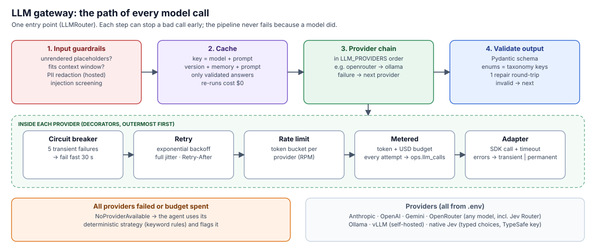

# AI platform

[← back to README](../README.md)

How the agents talk to models, and the guardrails, memory, judging, loops and ontology around them.
Every claim marked *measured* links to a number in [EVALUATION.md](EVALUATION.md).

- [LLM gateway](#llm-gateway)
- [Jev by TypeSafe](#jev-by-typesafe)
- [Other providers: frontier and local](#other-providers-frontier-and-local)
- [Guardrails](#guardrails)
- [Memory](#memory)
- [LLM-as-judge and human-weighted trust](#llm-as-judge-and-human-weighted-trust)
- [Loop engineering](#loop-engineering)
- [Ontology and knowledge graph](#ontology-and-knowledge-graph)
- [Deliberately not built](#deliberately-not-built)

## LLM gateway



`LLMRouter` (`llm/router.py`) is the gateway: the **only** way any agent reaches a model. That
gives one place for routing, guardrails, caching, validation, metering and fallback. I didn't add a
separate gateway service (LiteLLM or similar): it would be a second process doing the same job, and
one more thing to deploy and fail.

- **Routing.** `LLM_PROVIDERS` is an ordered fallback chain (e.g. `openrouter,ollama`). A guardrail
  rejection, provider error or invalid output falls through to the next provider.
- **Per-provider resilience** (decorators, outermost first): circuit breaker (5 transient failures →
  fail fast for 30 s), retry with exponential backoff and full jitter (honours `Retry-After`), token
  bucket rate limit per provider, and metering with a per-run token and USD budget.
- **Output contract.** Pydantic schema → JSON schema sent to the provider (strict where supported).
  The taxonomy is an enum, so an answer can't invent a category. One repair round-trip shows the model
  its own validation errors. Only validated answers are cached.
- **Never fatal.** If everything fails, or the budget is spent, the agent uses its deterministic
  strategy and the run continues.
- **Billing truth.** OpenRouter's *billed* cost and the model that actually answered (routers pick per
  call) are recorded per call in `ops.llm_calls`.

## Jev by TypeSafe

Jev is TypeSafe's **System-One** model. Instead of generating text token by token, it answers *typed
questions* (a choice from options you supply, a score, a yes/no) with **calibrated probabilities**.
That is an unusually good fit for this pipeline: almost everything the agents decide is a typed
choice (which category, which severity, is this a hazard, is this proposal correct).

**How it is used here**

| Role | How | Status |
|---|---|---|
| Ticket classification | **Jev Router** via OpenRouter (`OPENROUTER_MODEL=typesafe/jev-router`) | Recommended default; measured |
| LLM-as-judge for auto-approval | **Jev Router** (`JUDGE=openrouter:typesafe/jev-router`) | Recommended default; measured |
| Data Quality and Gold Design agents | **Jev Router** (same setting as classification) | Measured: 13 of 14 SQL items valid after the repair loop, the 14th rejected by the guardrail; no invented statistics; $0.11 for both agents |
| Native typed classification | **Jev 1.13** via OpenRouter's decisions API (`CLASSIFIER_BACKEND=jev`, `agents/jev.py`): one `choice` question per field, so answers *cannot* fall outside the taxonomy, and confidence is a real probability. Uses TypeSafe's own API instead when `TYPESAFE_API_KEY` is set | Opt-in; measured |

**What it delivered** ([evaluation](EVALUATION.md#classification-strategies)):
- **Classifier:** 100% on labels, templates and unseen phrasing, matching a fixed frontier model
  (Claude Sonnet 5.5: 98–100%) at **$0.06–0.08 vs $0.24** for the full evaluation, **3–4× cheaper**.
- **Judge:** combined with human feedback, it raised auto-approval precision from 79% to **97%** and cut
  wrongly approved answers from 21 to 5. Ordering the review queue by its trust score puts actual
  mistakes in all of the top 10 ([details](EVALUATION.md#llm-as-judge--human-weighted-trust)).
- **SQL agents:** all 3 gold marts valid first time; 10 of 11 DQ rules valid after the repair loop
  (the 11th rejected by the guardrail, never shown to a reviewer), for $0.11
  ([details](EVALUATION.md#loop-engineering)).
- **On new data:** it classified 200 never-seen values from a 20,000-row synthetic drift test, with
  100% accuracy against ground truth, for $0.056 ([details](TESTING.md#random-synthetic-data)).
- **Native Jev:** 98–99% category accuracy for **$0.008** for the full evaluation (7–10× cheaper than
  Jev Router), ~0.5 s per item. In the 20,000-row synthetic drift test it classified all 200 new
  values correctly for $0.006. It over-flags safety hazards (91% accurate, no hazard missed), and it
  answers only typed questions, so it can't write the free-text `issue_type` (new templates get
  `unspecified`). That's why it is opt-in rather than the default
  ([details](EVALUATION.md#classification-strategies)).

**Precisely what was measured.** OpenRouter serves *Jev Router*: Jev decides which model and how much
reasoning each request gets. In these runs it routed mostly to DeepSeek v4.1 Flash and sometimes to
Gemini 3.8 Flash, and `ops.llm_calls.served_model` records which model answered every call. Because
it picks reasoning models, it needs output headroom: without it, answers were cut off (an issue the
eval caught and fixed). Raw Jev (calibrated typed answers) is a different endpoint on the same
OpenRouter key (`/api/alpha/decisions`, model `typesafe/jev-1.13`), and is measured separately.

## Other providers: frontier and local

| Provider | How | Notes |
|---|---|---|
| Anthropic | official `anthropic` SDK | default `claude-opus-5-5` at `effort: low`; structured output via `output_config.format`; refusals handled; server-side refusal fallbacks |
| OpenAI | `openai` SDK | `max_completion_tokens`, no custom temperature; output headroom for hidden reasoning tokens |
| Gemini | `google-genai` SDK | JSON mode + `response_json_schema` |
| OpenRouter | OpenAI-compatible | one key → hundreds of models, including **Jev Router** (above) |
| Ollama | OpenAI-compatible | local, private, $0; *must* run with a larger context (see guardrails) |
| vLLM | OpenAI-compatible | self-hosted GPU serving for volume (see [Scaling](SCALING.md)) |

**Why a local option at all:** privacy, $0 marginal cost, and a last resort when hosted APIs are
down. *Measured:* gemma3:4b on a laptop reaches 90% on the holdout set (vs 26.7% for the keyword
rules), at ~22 s per batch.

## Guardrails

| Stage | Guardrail | Where |
|---|---|---|
| Input | **Pre-flight**: no unrendered placeholders, non-empty task, prompt + output budget fits the provider's context window (otherwise route to the next provider) | `llm/guardrails.py` |
| Input | **PII redaction** for hosted providers (e-mail, phone, Luhn-valid card numbers); self-hosted models see raw text | `llm/guardrails.py` |
| Input | **Prompt-injection screening**: instruction-like ticket text is flagged and logged; prompts frame all inputs strictly as data | `llm/guardrails.py`, prompts |
| Output | JSON schema + Pydantic validation, taxonomy enums, one repair round | `llm/router.py` |
| Output | Strict on semantics, lenient on cosmetics (`"door_won't_lock"` is normalised, not a batch failure) | `agents/classification.py` |
| Output | Truncation detection (`finish_reason=length`, server-side prompt truncation) | adapters |
| Actions | SQL guard: single statement, no DDL/DML, denied schemas, `READ ONLY` transaction + timeout | `agents/sql_guard.py` |
| Actions | Agents only propose; approval is a human or a measured policy | `agents/proposals.py` |
| Cost | Token and USD budget per run; rate limits per provider | `llm/decorators.py` |
| Change control | Eval promotion gate; versioned prompts in the cache key; leakage tests | `agents/evaluation.py`, tests |

The context-window pre-flight exists because of a real incident: Ollama's default 2k context cut a
12k-token prompt to 2,051 tokens **without any error**, and the model would have answered anyway.

## Memory

| Memory | What it holds | How it's used |
|---|---|---|
| **Semantic** (facts) | Approved `ref.*` maps, taxonomy, ontology | Known values never go to the LLM at all |
| **Episodic** (what happened) | The 41 human corrections from review (`config/memory/episodes.jsonl`, or the live DB) | Similar past corrections are recalled per batch and shown to the model as precedents |
| **Procedural** (how to do it) | Rules consolidated from reviews (`config/memory/procedures/*.md`) | Injected into the system prompt |

The memory fingerprint is part of the cache key, so changing memory never serves stale answers.
**Human feedback outranks the model by construction:** episodes and procedures are human decisions,
presented as authoritative precedent.

*Measured* ([details](EVALUATION.md#memory)): memory helped where it was learned (templates 91.3% →
94.6%, hazard 93.3% → 100%) and showed **no gain on novel phrasing** (holdout 90.0% → 86.7%, within
noise). That fits production well, because the same kinds of tickets recur daily, but it is not a
general accuracy boost, and I don't claim it is.

## LLM-as-judge and human-weighted trust

When `JUDGE` is set (e.g. `openrouter:typesafe/jev-router`), a **different** model judges each
classification proposal, and auto-approval uses a trust score:

```
trust = 0.6 · human  +  0.3 · judge  +  0.1 · agent      (missing signals dropped, weights renormalised)
```

| Signal | Meaning | Why this weight |
|---|---|---|
| human | Share of human-approved decisions on *similar* inputs that agree with the proposal (all fields, not just category) | Humans own the business semantics: they are ground truth |
| judge | Independent model's probability the proposal is correct | A second opinion whose errors are less correlated with the generator's |
| agent | The generating model's own confidence | Least calibrated (gemma3 said 0.95 on answers a reviewer corrected) |

A human decision on the item itself is never overridden. Trust only decides auto-approval, and the
order of the review queue (least trusted first). *Measured* on 187 real decisions
([details](EVALUATION.md#llm-as-judge--human-weighted-trust)): compared with self-confidence,
human-weighted trust **auto-approves 23.6 points more work and lets 76% fewer errors through**
(21 → 5). Comparing a first version that matched humans on category only is what revealed that
the human signal must compare the whole decision.

## Loop engineering

The Data Quality and Gold Design agents write SQL, which can be checked mechanically. Their output
goes through a bounded **propose → verify → repair** loop (`agents/loop.py`): rules that fail
verification are sent back **with the exact database error**, for at most 2 rounds. Only the failures
are re-sent, and a failed repair call can never lose the first-pass results. Each run records
first-pass vs final results, so every run is itself an A/B
([measured](EVALUATION.md#loop-engineering)).

I deliberately did not loop the classification agent: its outputs have no mechanical check beyond
the schema (which already has one repair round), and "is this the right category" is what the judge
and humans are for.

## Ontology and knowledge graph

`config/ontology.yaml` (SKOS-style, business-owned) declares:
- **related categories**: one problem legitimately belonging to two categories (emergency lighting is
  fire safety *and* electrical; door locks are security *and* maintenance);
- **party qualifications**: which vendors are qualified for which categories. This is an
  *assumption* from vendor names, to be confirmed by the facilities team.

It is loaded into `ref.category_relations` / `ref.party_qualifications` and used in silver:

| | Without ontology | With ontology |
|---|---|---|
| "label conflicts with description" flags | 450 | **0**, all 450 were declared overlaps (unrelated pairs are still flagged; unit-tested) |
| vendor working outside its qualification | not detectable | **2,230 of 2,970** specialist-vendor tickets |

`gold.kg_edges` exposes the result as a knowledge graph: about 35k (subject, predicate, object) edges
covering ticket → category / building / asset / party / issue type, asset → building, issue type →
category, party → qualified for, and category ↔ related. It is queryable in SQL and loadable into
Neo4j or RDF tooling as-is.

## Deliberately not built

| Idea | Decision | Reasoning |
|---|---|---|
| **MCP servers** | No | MCP exposes tools to *external* agent clients. Here the pipeline is the only client of a handful of in-process functions; MCP would add a process and a protocol with no user. It would make sense later for analysts' own assistants to query gold or the review queue, on top of this system. |
| **Deep agents** (planner, sub-agents, scratch filesystem) | No | No task here needs open-ended exploration: each agent is one structured call plus deterministic verification. The rubric explicitly penalises over-engineering. |
| **Agent framework** (LangGraph, CrewAI) | No | Same reason. The loop, memory and judge are each ~100 lines of plain code with tests. |
| **AWS Bedrock** | Not included | Needs AWS SigV4 credentials no reviewer has; OpenRouter covers multi-vendor access. Claude on Bedrock is a different client class in the same Anthropic SDK if required. |
| **vLLM in docker-compose** | Supported, not bundled | Needs an NVIDIA GPU; on a laptop the container would crash. The adapter exists; see [Scaling](SCALING.md). |
| **Kafka on the critical path** | Optional | Events go to a transactional outbox; `--profile kafka` relays them. See [Operations](OPERATIONS.md#events-and-kafka). |
| **Separate LLM gateway service** | No | `LLMRouter` already is the gateway (see above). |
