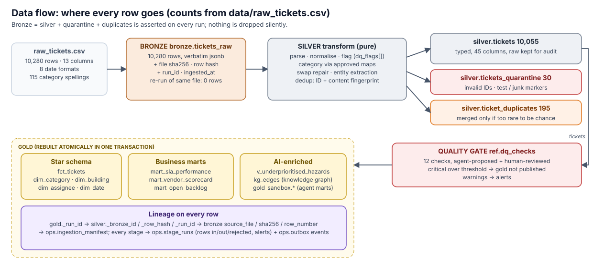

# Data pipeline

[← back to README](../README.md)

## Storage and layer separation

PostgreSQL 16, one **schema per layer**: `bronze`, `silver`, `gold`, plus `ref` (curated reference
data that silver depends on: taxonomy, approved agent mappings, approved DQ checks) and `ops`
(pipeline metadata). Schemas give hard separation that permissions can enforce (an analyst role gets
`gold` only, agents read `silver`/`gold`/`ref` only). One database keeps the take-home runnable with
one command. At scale the same layering maps onto object storage plus a lakehouse format
(see [Scaling](SCALING.md)).

## Bronze: raw, schema-on-read, no data loss

- Each CSV row is stored **verbatim** as a jsonb `payload` (every value as text; a short row keeps
  JSON nulls rather than invented empty strings). Lineage columns: `source_file`,
  `source_file_sha256`, `source_row_number`, `ingested_at`, `run_id`, and `row_hash` (sha256 of the
  canonical payload) for duplicate tracking across files.
- **Idempotent by content.** Files are content-addressed in `ops.ingestion_manifest`, so re-landing
  identical bytes inserts 0 rows. `UNIQUE (file_sha256, row_number)` makes even a crashed half-load
  safe to repeat. Rows and manifest commit in one transaction.
- **Schema drift** is detected, not fatal. The header is compared with the previous file's; added or
  removed columns raise an alert and a `bronze.schema_drift` event, and the new column is kept in the
  payload (tested).
- **Metadata auto-tagging at landing**: `ops.column_catalog` gets a semantic type, a sensitivity level
  and tags per column (e.g. `submitted_by` → `person_name`, `pii`; `description` → `free_text`,
  `may_contain_pii`). This is deterministic on purpose: a governance tag must be reproducible.
- A SQL profiler (`ops.column_profiles`) records null/placeholder rates, distinct counts, value shapes,
  numeric stats and day/month evidence for ambiguous dates. Above 1M rows it profiles a
  `TABLESAMPLE`.

## Silver: cleansed, typed, deduplicated

Full rules, counts and rationale: **[CLEANING_RULES.md](CLEANING_RULES.md)**. In short:

| Outcome | Rows | |
|---|---|---|
| `silver.tickets` | **10,055** | 40+ typed columns, `dq_flags[]`, original values in `raw`, lineage `_bronze_id/_row_hash/_run_id` |
| `silver.tickets_quarantine` | **30** | invalid ticket ID (26) and/or explicit test/junk markers |
| `silver.ticket_duplicates` | **195** | re-submitted tickets (new ID, timestamp and submitter, same everything else) whose content is too rare to match by chance; 6 more low-information pairs are kept and flagged `possible_duplicate` for review |

The silver stage asserts `bronze = silver + quarantine + duplicates` on every run and fails if not.
Silver is a deterministic function of bronze plus the approved reference maps, rebuilt inside one
transaction, so readers never see a half-built layer and re-runs produce identical output
(tested with an md5 fingerprint over the business columns).

Things profiling found that a schema alone would never tell you:
- **Dates:** 8 formats, including epoch seconds. Slash dates are MM/DD, decided from the data (the first
  component is never above 12).
- **Hidden duplicates:** 200 tickets numbered TKT-11000 and up copy older tickets with only ID,
  `created_at` and `submitted_by` changed.
- **Time-travel resolutions:** 35% of resolved tickets have `resolved_at < created_at`, and about 20% have
  status and timestamps that contradict each other.
- **Swapped fields:** category and description were sometimes entered in each other's fields.
- **Priority can't be imputed:** it is statistically independent of SLA hours, so it isn't inferred.
- **Duplicate closures:** 808 tickets are closed as "Duplicate of #N". Every reference resolves.
- **Overlapping categories:** 450 tickets had a human label that disagreed with the description, and
  all 450 were legitimate overlaps (emergency lighting is both fire safety and electrical). The
  ontology removed that noise; real contradictions are still flagged.
- **Dispatch looks random:** 75% of tickets assigned to a specialist vendor fall outside its
  (assumed) specialty, e.g. a pest-control firm on elevators. Flagged as
  `assignee_not_qualified_for_category`.

## Quality gate (between silver and gold)

Approved checks in `ref.dq_checks` run on every pipeline run, read-only with a statement timeout,
and are recorded in `ops.dq_results`. A **critical** check over its threshold **blocks gold
publication**: the previous gold stays in place and the run fails as non-retryable. Warnings are
reported.

The 12 shipped checks were proposed by the Data Quality Agent, then reviewed: 8 were approved as-is
and 4 were corrected by a human (see [AGENTS.md](AGENTS.md#2-data-quality-agent-option-b)). On this
data all 12 pass; the warning thresholds sit just above today's real rates, so they alert if
anything gets *worse*.

## Gold: business-ready models

Rebuilt from `sql/gold/*.sql` in **one transaction**. Postgres DDL is transactional, so consumers
switch atomically. A conformed star at ticket grain (`fct_tickets` + `dim_category`, `dim_building`,
`dim_assignee`, `dim_date`; natural keys, which stay stable across rebuilds) feeds three marts I'd
expect a facilities lead to ask for first:

| Model | Question it answers | Why this one |
|---|---|---|
| `mart_sla_performance` (month × category × priority) | Are we meeting SLAs, and where are we slipping? | SLAs are the contract with the business, and the one metric every ops review starts with. Every rate carries the row count it is based on (`sla_measurable`, `metric_coverage_pct`), because many tickets lack a usable SLA or resolution time. |
| `mart_vendor_scorecard` (per assignee) | Which vendors and in-house teams are fast, cheap, or doing rework? | It drives contract and staffing decisions. Includes rework signals parsed from notes (`temporary_fix_pct`, `not_reproduced_pct`) that are invisible in the raw data. |
| `mart_open_backlog` (building × category × priority, as-of snapshot) | Where is work piling up right now, and how old is it? | It is the operational view: aging buckets and tickets past SLA. The as-of date is the latest ticket in the data, so rebuilds are deterministic. |
| `v_underprioritised_hazards` | Which open **safety hazards** did a human file as low priority? | Only possible because of LLM enrichment (severity and hazard derived from free text). This is the most direct "AI made the data more useful" artifact. |
| `kg_edges` | Graph questions: which assets in a building keep failing, which vendors work outside their qualifications? | (subject, predicate, object) triples built from silver + the ontology; loadable into a graph DB as-is. See [AI platform › Ontology](AI_PLATFORM.md#ontology-and-knowledge-graph). |
| `gold_sandbox.*` | Exploratory marts proposed by the Gold Design Agent | Approved views for analysts to try. Promotion into `gold` is a code change. |

Duplicate closures count as volume but are excluded from performance metrics.

> **Honest data note:** in this dataset, resolution timestamps are not credible: median resolution
> is about 200 days, 35% are negative, and SLA compliance computes to under 1%. The marts are built
> correctly and say what share of tickets each metric covers. The numbers mean the source's
> timestamps need fixing before anyone acts on SLA reporting, which is exactly what the
> `resolved_before_created` flag and the corresponding DQ check surface.

## Idempotency, at every layer

| Where | Mechanism |
|---|---|
| Bronze | content-addressed manifest + `UNIQUE (file_sha256, row_number)` + one transaction |
| Silver, gold | deterministic full rebuild in one transaction (same input → same output) |
| Concurrent runs | session advisory lock: two runs can never interleave |
| API | `Idempotency-Key` header. A replay returns the same run (`Idempotent-Replayed: true`); the same key with a different body returns 422 |
| Worker | lease + heartbeat. A re-claimed run is safe to re-execute because the pipeline is idempotent |
| LLM | response cache keyed by (model, prompt version, exact prompt): re-runs never pay twice |
| Agent proposals | values with a pending proposal aren't re-sent to the LLM |
| Kafka | idempotent producer + `event_id` header for consumer dedup (at-least-once relay) |

## Lineage and observability

- **Row lineage, end to end:** gold `_run_id` → silver `_bronze_id/_row_hash/_run_id` → bronze
  `source_file/sha256/row_number/ingested_at` → `ops.ingestion_manifest`. Reference-data lineage: every
  mapping has `source` (seed, rules, or `llm:<provider>/<model>`), `proposal_id` and
  `approved_by/approved_at`.
- **Who/what/when** for every transformation: `ops.stage_runs` (rows in/out/rejected, metrics, alerts,
  timings) and domain events in `ops.outbox` (`pipeline.run.*`, `pipeline.stage.*`, `bronze.schema_drift`,
  `dq.check.failed`, `agent.proposal.*`).
- **One trace ID** flows from the API (`traceparent` or `X-Trace-Id`, echoed back) through the job
  queue into every JSON log line, LLM call, proposal and event.
- **Metrics and alert thresholds** (configurable): quarantine rate, null-rate drift versus the previous
  run, LLM failure rate, pending reviews, DQ failures. LLM tokens, cost, latency and cache hits per
  run are in `ops.llm_calls`.
