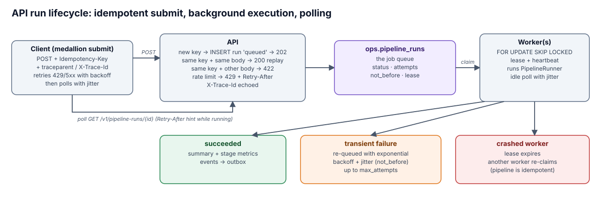

# Operations

[← back to README](../README.md)

- [API and idempotency](#api-and-idempotency)
- [Background worker](#background-worker)
- [Retries, backoff, jitter, polling, rate limits](#retries-backoff-jitter-polling-rate-limits)
- [Events and Kafka](#events-and-kafka)
- [Observability](#observability)
- [CLI reference](#cli-reference)
- [Configuration](#configuration)

## API and idempotency



| Method | Path | Notes |
|---|---|---|
| POST | `/v1/pipeline-runs` | `Idempotency-Key` required → `202` + `Location`; replay `200` + `Idempotent-Replayed: true`; key reuse with a different body `422`; `429` + `Retry-After` when rate-limited |
| GET | `/v1/pipeline-runs/{id}` | status, attempts, per-stage metrics; `Retry-After` hint while running |
| GET | `/v1/pipeline-runs` | recent runs |
| GET | `/v1/proposals?status=&agent=` | agent proposals |
| POST | `/v1/proposals/{id}/approve` or `/reject` | human-in-the-loop decision (`{"reviewer": "..."}`) |
| GET | `/healthz`, `/readyz` | liveness / DB readiness |

Optional `API_KEY` in `.env` makes every endpoint require `X-API-Key`. Every response echoes `X-Trace-Id`.

Idempotency, at every layer:

| Where | Mechanism |
|---|---|
| Bronze | content-addressed file manifest + `UNIQUE (file_sha256, row_number)` + one transaction |
| Silver, gold | deterministic full rebuild in one transaction |
| Concurrent runs | session advisory lock |
| API | `Idempotency-Key`: replay → same run (`Idempotent-Replayed: true`); same key, other body → 422 |
| Worker | lease + heartbeat; a re-claimed run is safe because the pipeline is idempotent |
| LLM calls | cache keyed by model + prompt version + memory + exact prompt |
| Kafka | idempotent producer + `event_id` header for consumer dedup |

## Background worker

- **Claiming:** runs are claimed from `ops.pipeline_runs` with `FOR UPDATE SKIP LOCKED`, so any
  number of workers can share the queue.
- **Leases:** a claimed run holds a lease that a heartbeat thread extends. If a worker dies, the lease
  expires and another worker re-claims the run.
- **Retries:** transient failures are re-queued with exponential backoff and jitter (`not_before`),
  up to `JOB_MAX_ATTEMPTS`. Permanent failures (e.g. a blocking quality gate) are not retried.
- **Idle polling:** waits a jittered interval, so a fleet of workers doesn't hit the database in
  lockstep.

## Retries, backoff, jitter, polling, rate limits

One `RetryPolicy` (capped exponential backoff, **full jitter**, honours `Retry-After`) is used by:
- LLM calls;
- the native Jev client;
- database start-up;
- worker re-queues;
- the outbox relay;
- the API client.

`poll_until` (growing, jittered intervals) is what `medallion submit --wait` uses. Token-bucket rate
limits exist per LLM provider (`<PROVIDER>_RPM`) and per API client (`API_RATE_LIMIT_RPM`, an
LRU-bounded set of buckets).

## Events and Kafka

Events (`pipeline.run.*`, `pipeline.stage.*`, `bronze.schema_drift`, `dq.check.failed`,
`agent.proposal.*`) are written to `ops.outbox` **in the same transaction** as the change they
describe. With `docker compose --profile kafka up --build`, a relay publishes them to the
`medallion.events` topic:
- with an idempotent producer;
- at-least-once delivery;
- with `event_id`, `event_type` and `trace_id` headers.

This path was verified end to end, with 203 events consumed from the topic. Without Kafka, the
outbox is still a queryable audit log.

## Observability

- **One trace ID** (W3C `traceparent` or `X-Trace-Id`, echoed back) flows from the API through the
  queue into every JSON log line, LLM call, proposal and event.
- `ops.stage_runs`: rows in/out/rejected, duration, metrics and alerts per stage.
- `ops.llm_calls`: every attempt with status (ok / cache_hit / error / invalid_output /
  guard_rejected / refused), tokens, billed cost in USD, latency and the model that actually answered.
- **Alert thresholds:** quarantine rate, null-rate drift versus the previous run, LLM failure rate,
  pending reviews, DQ failures.
- `medallion report` gives a human-readable tour of every layer.

## CLI reference

```
medallion migrate                         apply migrations
medallion run [--source F] [--as-of D]    full pipeline in-process
medallion status [RUN_ID]                 recent runs
medallion report                          tour of every layer
medallion agent-dq                        Data Quality Agent  → proposals
medallion agent-gold [--domain-file F]    Gold Design Agent   → proposals
medallion review list|approve|reject [IDS] [--agent A] [--all-pending]
medallion eval --strategies rules,ollama [--min-accuracy 0.9] [--show-errors]
medallion export-seeds                    approved ref maps → config/seeds (for code review)
medallion api | worker | relay            services
medallion submit [--wait] [--idempotency-key K]   API client (retries + polling)
```

Also: `medallion experiment judge [--judge provider:model]` for the offline auto-approval policy A/B.

## Configuration

Everything is read from the environment or `.env` (see [`.env.example`](../.env.example));
credentials only ever come from there. The main groups:

| Group | Variables |
|---|---|
| Database | `DATABASE_URL` |
| Data rules | `DEDUP_SAFETY_BITS` (content-dedup margin, default 3) |
| Model chain | `LLM_PROVIDERS`, `<PROVIDER>_API_KEY`, `<PROVIDER>_MODEL`, `<PROVIDER>_BASE_URL`, `<PROVIDER>_RPM`, `<PROVIDER>_CONTEXT_TOKENS` |
| Resilience and cost | `LLM_TIMEOUT_S`, `LLM_MAX_ATTEMPTS`, `LLM_BACKOFF_BASE_S`, `LLM_BACKOFF_MAX_S`, `LLM_CONCURRENCY`, `LLM_BATCH_SIZE`, `LLM_MAX_TOKENS_PER_RUN`, `LLM_MAX_COST_USD_PER_RUN`, `CIRCUIT_FAILURE_THRESHOLD`, `CIRCUIT_RESET_S` |
| Review policy | `LLM_AUTO_APPROVE_CONFIDENCE`, `JUDGE`, `TRUST_WEIGHT_HUMAN/JUDGE/AGENT` |
| Jev | `CLASSIFIER_BACKEND=jev` (uses `OPENROUTER_API_KEY`), optional `TYPESAFE_API_KEY`, `TYPESAFE_MODEL` |
| API | `API_KEY` (optional), `API_URL`, `API_RATE_LIMIT_RPM` |
| Events | `KAFKA_BOOTSTRAP_SERVERS`, `KAFKA_TOPIC` |
| Observability | `LOG_LEVEL`, `LOG_FORMAT`, `TIMEZONE` (default `Asia/Kolkata`: log timestamps in IST), `ALERT_*` |
